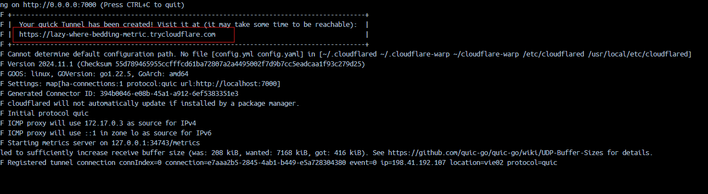

## Описание

**Stremio-Zamunda** е FastAPI приложение, което предоставя потоци от Zamunda и интеграция с OMDB API. Потребителите могат да конфигурират приложението за търсене на торенти с българско аудио..Този Dockerfile създава контейнер за **Stremio-Zamunda**, който включва допълнителна конфигурация за **Cloudflare Tunnel**. Това позволява да направите аддона достъпен през интернет без необходимост от директно отваряне на портове в рутера.

## Конфигурация

- **OMDB API ключ**: Изисква се за извличане на данни за филми/сериали.
- **Zamunda акаунт**: Потребителско име и парола за достъп до Zamunda.

## Стъпки за изграждане и стартиране

1. **Създайте образа**:
   ```bash
   docker build -t stremio-zamunda .
   ```

2. **Стартирайте контейнера**:
   ```bash
   docker run -d --name stremio-zamunda -p 7000:7000 stremio-zamunda
   ```

3. **Достъп до приложението**:
   - Чрез Cloudflare Tunnel: URL адрес, предоставен от Cloudflare.Него може да намерите в логовете на контейнера веднага след стартиране.


  - След това аддона ще може да се инсталира от ```https://<АДРЕСА ОТ ЛОГОВЕТЕ>/manifest.json```

4. **Използвани пакети**
    zamunda-api

    Библиотека за работа със Zamunda.
    Позволява търсене и извличане на данни за торенти.
    https://github.com/murrou-cell/zamunda-api.git